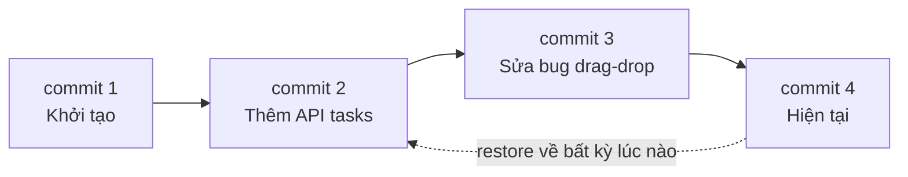

# Version Control System là gì?

> **Bối cảnh:** Trước khi mở terminal, An cho bạn xem một "di tích" của dự án cũ: folder chứa `task-board-final.zip`, `task-board-final-v2.zip`, `task-board-FIXED-chinh-sua-boi-Chi.zip`. Bài này giải thích vì sao team từ bỏ cách đó.

## Ba vấn đề của quản lý code bằng tay

1. **Không biết ai sửa gì, khi nào, vì sao** — lịch sử nằm trong trí nhớ con người, người nghỉ việc thì lịch sử mất theo.
2. **Hai người sửa cùng file phải hợp nhất thủ công** — ai copy đè sau sẽ âm thầm xóa code của người kia.
3. **Quay về bản cũ gần như bất khả thi** — bug xuất hiện hôm nay, không ai nhớ bản tuần trước "tốt" nằm ở file nào.

Version Control System (VCS) tồn tại để xử lý đúng ba vấn đề đó.

## Bản chất: hệ thống ghi lịch sử theo commit

VCS **ghi lại mọi thay đổi theo thời gian** dưới dạng các mốc gọi là commit — mỗi mốc có tác giả, thời gian, mô tả và nội dung thay đổi. Từ nền tảng đó có ba năng lực:

| Năng lực | Giải quyết vấn đề nào |
|---|---|
| **History** | Ai sửa gì, khi nào, tại sao — tra cứu được |
| **Restore** | Quay về bất kỳ mốc nào mà không mất dữ liệu |
| **Branching** | Nhiều người làm song song rồi hợp nhất lại an toàn |

## Ba mô hình VCS — vì sao Git chọn distributed

- **Local**: lịch sử chỉ nằm trên 1 máy → hỏng ổ cứng là mất tất cả, không làm nhóm được.
- **Centralized** (SVN): lịch sử ở một server trung tâm, mọi thao tác cần mạng; server chết thì cả team dừng việc.
- **Distributed** (Git): **mỗi máy giữ bản sao đầy đủ của repo kèm toàn bộ lịch sử**; server chỉ là điểm đồng bộ. Máy ai hỏng cũng khôi phục được từ người khác.

Điểm thực tế bạn cần nhớ ngay: nhờ distributed, **commit, xem lịch sử, tạo branch đều chạy offline** — chỉ push/pull mới cần mạng.

## Sai lầm thường gặp

- Nhầm VCS với Google Drive: Drive đồng bộ *file mới nhất*, không có khái niệm commit, không hợp nhất thay đổi song song của hai người.
- Tưởng dự án cá nhân không cần VCS: sự cố "xóa nhầm đoạn code tuần trước" không phân biệt team size.

## References

- [Pro Git 1.1: About Version Control](https://git-scm.com/book/en/v2/Getting-Started-About-Version-Control)
- [Pro Git 1.3: What is Git?](https://git-scm.com/book/en/v2/Getting-Started-What-is-Git%3F)

## Học tiếp

[Git là gì & vì sao nên dùng?](what-is-git.md) — mô hình hoạt động bên trong của Git mà mọi lệnh sau này đều quy về đó.
