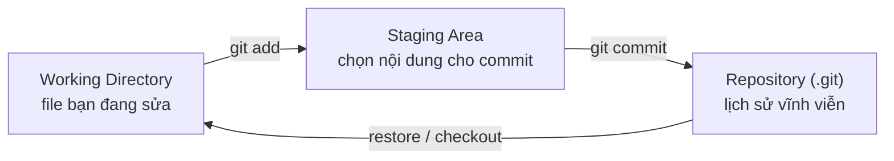

# Git là gì & vì sao nên dùng?

> **Bối cảnh:** Chi vừa hỏi trong nhóm chat: *"Tao commit rồi mà sao web không thấy code mình?"* — câu hỏi kinh điển xuất phát từ việc nhầm Git với GitHub. Bài này dứt điểm nhầm lẫn đó trước khi bạn gõ lệnh thật.

## Tách bạch Git và GitHub — một lần cho đủ

| | Git | GitHub |
|---|---|---|
| Bản chất | Phần mềm quản lý phiên bản chạy **trên máy bạn** | Dịch vụ lưu trữ repo Git **trên cloud** |
| Hoạt động | Offline hoàn toàn | Cần internet |
| Nhiệm vụ | Commit, branch, lịch sử | Chia sẻ, review (PR), cộng tác |

GitHub chỉ là *một* lựa chọn remote — còn có GitLab, Bitbucket. Quy tắc nhớ nhanh: **commit xảy ra trên máy; push mới đưa lên mạng**. Chi commit xong chưa push nên web đương nhiên chưa thấy.

## Ba vùng trạng thái — mô hình trung tâm của khóa học

Mọi lệnh Git cơ bản đều chỉ làm một việc: di chuyển thay đổi giữa ba vùng.

Đặt vào tình huống thật: bạn sửa `board.js` (Working Directory), chạy `git add board.js` để chốt nội dung (Staging), rồi `git commit` ghi vào lịch sử (Repository). Ba lệnh quen thuộc nhất của ngày mai chính là ba mũi tên này.

## Snapshot, không phải diff

Nhiều VCS lưu từng dòng thay đổi so với bản cũ. Git lưu mỗi commit như **ảnh chụp toàn bộ cây thư mục** tại thời điểm đó; file không đổi được tham chiếu lại thay vì lưu trùng. Hệ quả thực tế:

- Xem lịch sử, so sánh phiên bản cực nhanh vì mọi thứ nằm local.
- Repo phình to nếu commit file binary thay đổi liên tục (chi tiết ở bài Repository phình to, Module 04).

## Vì sao team chọn Git

- **Nhanh & offline**: toàn bộ lịch sử nằm trong `.git` trên máy.
- **Branch gần như miễn phí**: tạo nhánh tức thì để thử nghiệm (Module 02 sẽ làm thật).
- **Toàn vẹn dữ liệu**: mỗi commit có hash SHA-1; lịch sử không thể bị sửa ngầm mà không phát hiện.
- **Chuẩn ngành**: hầu hết dự án và tài liệu mặc định nói về Git.

## Khi nào Git KHÔNG phù hợp

File binary thay đổi liên tục (file thiết kế lớn, video, dataset cỡ GB): mỗi lần sửa là thêm một snapshot đầy đủ, repo phình to nhanh. Trường hợp này cần Git LFS hoặc công cụ khác.

## Sai lầm thường gặp

- Nói "commit lên GitHub" — commit chỉ nằm trên máy; nói đúng hơn là "commit cục bộ" hoặc "push lên GitHub".
- Sợ gõ sai lệnh làm hỏng tất cả — các lệnh cơ bản không phá được lịch sử đã commit; phần nguy hiểm (`reset --hard`, force push) sẽ được cảnh báo rõ ở Module 04.

## References

- [Pro Git 1.3: What is Git?](https://git-scm.com/book/en/v2/Getting-Started-What-is-Git%3F)
- [Pro Git 1.2: A Short History of Git](https://git-scm.com/book/en/v2/Getting-Started-A-Short-History-of-Git)

## Học tiếp

[Cài đặt Git](install-git.md) — biến lý thuyết thành terminal chạy được trên máy bạn.
