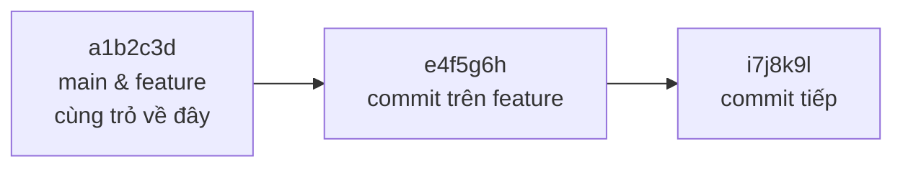

# Branch — Tạo và Merge nhánh

> **Bối cảnh:** An giao task mới: *"Làm tính năng kéo thả task. Làm trên nhánh riêng, đừng đụng main — main phải luôn chạy được để demo."* Đây là lý do tồn tại của branch.

## Vấn đề: làm song song mà không giẫm chân

Bạn cần 3 ngày cho drag-drop, nhưng bug hiển thị có thể phát sinh bất kỳ lúc nào cần sửa ngay trên code ổn định. Nếu tất cả nằm trên một dòng code: tính năng dở dang lẫn vào hotfix, không tách được bản demo. Branch giải quyết bằng cách cấp cho mỗi dòng công việc **một không gian độc lập**.

## Bản chất: branch chỉ là con trỏ

Điểm bất ngờ nhất với người mới: tạo branch trong Git **không copy code**. Một branch chỉ là file text ~41 byte chứa hash của commit cuối dòng đó:



Khi bạn commit trên `feature/drag-drop`, con trỏ đó tiến tới commit mới; `main` đứng yên tại chỗ. Tạo nhánh = tạo 1 con trỏ = tức thì, không tốn dung lượng đáng kể.

## Quy trình đầy đủ với output thật

**1. Tạo và chuyển sang nhánh mới:**

```bash
git switch -c feature/drag-drop
```

Output:

```text
Switched to a new branch 'feature/drag-drop'
```

(Cú pháp cũ: `git checkout -b feature/drag-drop` — gặp nhiều trong tài liệu cũ, làm cùng việc.)

**2. Làm việc bình thường — add, commit vài lần:**

```bash
git add drag-drop.js index.html
git commit -m "Add draggable task cards"
git add board.js
git commit -m "Persist card order after drop"
```

**3. Xem bản đồ nhánh:**

```bash
git log --oneline --graph --all
```

Output:

```text
* i7j8k9l (HEAD -> feature/drag-drop) Persist card order after drop
* e4f5g6h Add draggable task cards
* a1b2c3d (main) Add task list markup and base styles
```

Thấy rõ: HEAD (bạn đang đứng) ở feature; main đứng yên sau 2 commit mới.

**4. Merge về main khi xong:**

```bash
git switch main
git merge feature/drag-drop
```

Output:

```text
Updating a1b2c3d..i7j8k9l
Fast-forward
 drag-drop.js | 45 ++++++++++++++
 board.js     | 12 +++++-
 2 files changed, 55 insertions(+), 2 deletions(-)
```

`Fast-forward` nghĩa là gì? Xem mục dưới.

**5. Dọn dẹp nhánh đã hợp nhất:**

```bash
git branch -d feature/drag-drop
```

Output:

```text
Deleted branch feature/drag-drop (was i7j8k9l).
```

## Hai kiểu merge

| Kiểu | Khi nào | Kết quả |
|---|---|---|
| **Fast-forward** | main chưa có commit nào kể từ điểm tách (trường hợp trên) | Chỉ kéo con trỏ main tiến lên — lịch sử thẳng hàng |
| **Three-way merge** | Cả hai nhánh đều có commit riêng | Tạo merge commit 2 cha nối hai dòng lịch sử |

Ba-way sẽ xuất hiện khi Chi cũng commit lên `main` trong lúc bạn làm drag-drop. Và nếu hai người sửa cùng một dòng — Git dừng lại chờ bạn xử lý: đó là **merge conflict**, bài riêng ở Module 03.

## Sai lầm thường gặp

- Nhét mọi thứ vào `main` vì "cho nhanh" → mất khả năng demo/hotfix độc lập; team thật cấm hành vi này.
- Quên mình đang đứng nhánh nào, commit lạc chỗ → kiểm tra bằng `git status` (nó luôn báo branch hiện tại).
- Dùng `-D` (xóa cưỡng bức) thay `-d` → Git mất cơ hội cảnh báo "nhánh còn commit chưa merge".

## References

- [Pro Git 3.1: What a Branch Is](https://git-scm.com/book/en/v2/Git-Branching-Branches-in-a-Nutshell)
- [Pro Git 3.2: Basic Branching and Merging](https://git-scm.com/book/en/v2/Git-Branching-Basic-Branching-and-Merging)

## Học tiếp

Chúc mừng hoàn thành vòng đời cốt lõi! Chuyển sang [Module 03: Collaboration](../03-collaboration/index.md) — từ hôm nay bạn làm việc trên repo thật của team.
