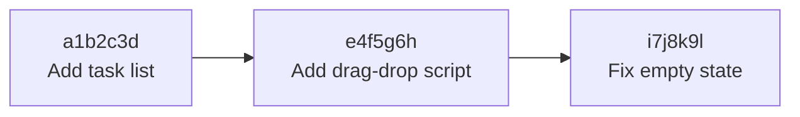

# git commit — Ghi snapshot vào lịch sử

> **Bối cảnh:** `index.html` và `styles.css` đã nằm trên bàn staging. Giờ là khoảnh khắc quan trọng nhất ngày 2: **commit đầu tiên** của bạn.

## Bước 1: Commit

```bash
git commit -m "Add task list markup and base styles"
```

Output:

```text
[main (root-commit) a1b2c3d] Add task list markup and base styles
 2 files changed, 24 insertions(+)
 create mode 100644 index.html
 create mode 100644 styles.css
```

Đọc output:

- `a1b2c3d` — hash rút gọn định danh commit này, duy nhất trên toàn hệ thống.
- `root-commit` — commit đầu tiên của branch (không có cha).
- Hai file staged trước đó giờ nằm vĩnh viễn trong lịch sử.

Xem lại lịch sử:

```bash
git log
```

Output:

```text
commit a1b2c3d... (HEAD -> main)
Author: Hazu Nguyen <hazu@congty.vn>
Date:   Mon Aug 24 09:32:11 2026 +0700

    Add task list markup and base styles
```

Tên/email ở đây chính là định danh bạn cấu hình ngày đầu — hai bài trước giờ nối vào nhau.

## Commit là gì bên trong?

Mỗi commit = **snapshot toàn bộ dự án** + metadata (tác giả, thời gian, message) + con trỏ trỏ về commit cha. Chuỗi các commit tạo thành lịch sử đi ngược được:



Snapshot gần như bất biến — nền tảng cho mọi thao tác cứu hộ và hoàn tác về sau.

## Nghệ thuật commit message

Message là **tài liệu duy nhất** kể lại ý đồ thay đổi khi ai đó đọc log sáu tháng sau.

Quy ước team phổ biến:

- Dòng đầu ≤ 50 ký tự, thì mệnh lệnh như một chỉ thị: `Add`, `Fix`, `Remove`.
- Không chấp nhận `"update"`, `"fix bug"`, `"asdf"` — vô dụng khi truy vết.
- Cần giải thích thêm? Cách một dòng trống rồi viết phần thân vì sao.

Ví dụ thật từ chính dự án sandbox:

```bash
git commit -m "Fix tasks not saving after page reload

localStorage key was read before init; move loadTasks()
call inside DOMContentLoaded handler."
```

> [!TIP]
> Commit nhỏ theo chủ đề (`Fix X`, `Add Y`) thay vì một commit khổng lồ cuối tuần. Commit nhỏ giúp review nhanh hơn và revert từng phần được.

## Hai biến thể cần biết ngay

**Commit luôn không qua add riêng lẻ** — tự stage mọi file *đã track*:

```bash
git commit -am "Update empty state text"
```

Lưu ý `-a` bỏ qua file mới (untracked) — vẫn phải add tay.

**Sửa commit vừa chớp mắt phát hiện sai** — thiếu file hoặc typo trong message:

```bash
git add forgotten.js
git commit --amend
```

`--amend` thay thế commit cũ bằng bản mới (hash đổi). **Chỉ an toàn khi chưa push** — sau khi push, sửa lịch sử sẽ gây rối cho người khác (lý do chi tiết ở Module 04).

## Sai lầm thường gặp

- Nhốt cả tuần việc trong một commit `"done week 1"` — mất khả năng quay lui có chọn lọc.
- Amend commit đã lên remote → đồng đội pull về gặp lịch sử lệch.
- Message mô tả *cái gì* nhưng quên *vì sao* — phần thân message là chỗ nói vì sao.

## References

- [Pro Git 2.2: Recording Changes](https://git-scm.com/book/en/v2/Git-Basics-Recording-Changes-to-the-Repository)
- [Conventional Commits](https://www.conventionalcommits.org/en/v1.0.0/) — quy ước message phổ biến

## Học tiếp

[git reset — Rút thay đổi khỏi Staging](git-reset.md): lỡ add nhầm thì xử lý thế nào.
