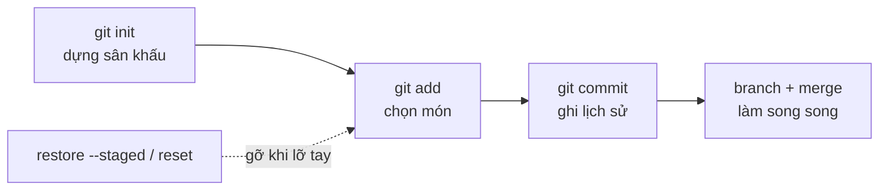

# Module 02: Basic Git Usage

**Bối cảnh:** An yêu cầu bạn luyện tay trên **`task-board-sandbox`** — repo cá nhân của riêng bạn — trước khi được vào repo thật. Mọi lỗi ở module này đều vô hại: hư thì xóa làm lại. Đây là lý do khóa học cố tình đặt module thực hành trước module cộng tác.

## Vòng đời lệnh cốt lõi

Mỗi ngày làm việc với Git là lặp lại chuỗi sau:

## Nội dung module

1. [git init](git-init.md) — biến folder thành repo, đọc `.git`.
2. [git add](git-add.md) — đưa thay đổi qua cửa staging, đọc `git status`.
3. [git commit](git-commit.md) — commit đầu tiên, message chuẩn, `--amend`.
4. [git reset](git-reset.md) — unstage an toàn, ba chế độ soft/mixed/hard.
5. [.gitignore](gitignore.md) — chặn node_modules và .env, bẫy file đã track.
6. [Branch](branches-merge.md) — nhánh drag-drop đầu tiên, fast-forward merge.

## Tiêu chí hoàn thành

- Repo sandbox có ít nhất 4 commit với message đúng quy ước thì mệnh lệnh.
- Kể lại được vì sao `notes.txt` không vào commit (bài reset).
- Một tính năng hoàn chỉnh đi qua nhánh riêng rồi fast-forward về `main`.

## Học tiếp

Sandbox chạy êm rồi — đến lúc vào đội hình thật: [Module 03: Collaboration](../03-collaboration/index.md).
