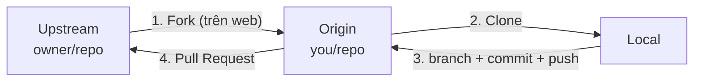

# Clone & Fork — Hai đường có code về máy

> **Bối cảnh:** An vừa mời bạn vào repo `an-dev/task-board`. Lệnh đầu tiên của buổi sáng:

```bash
git clone git@github.com:an-dev/task-board.git
```

Output:

```text
Cloning into 'task-board'...
remote: Enumerating objects: 248, done.
Receiving objects: 100% (248/248), done.
Resolving deltas: 100% (112/112), done.
```

## Clone đã tự làm giúp bạn những gì?

Kiểm tra bên trong thư mục mới tạo:

```bash
cd task-board
git remote -v        # origin trỏ sẵn về repo team
git branch -a        # thấy main + các nhánh remote origin/*
git log --oneline    # toàn bộ lịch sử từ commit đầu tiên của An
```

Clone = `init` + nối remote `origin` + tải **toàn bộ lịch sử, mọi branch** + checkout branch mặc định. Bạn đang đứng trên bản sao đầy đủ của dự án — offline vẫn xem được mọi thứ.

Quyền hạn của bạn trong repo team: **clone, pull — được; push lên `main` — bị chặn** (An cấu hình protection). Push chỉ cho phép trên nhánh tính năng riêng. Đó là quy trình bài sau.

## Fork là gì — và tại sao cần cho OSS

Với repo bạn **không có quyền ghi** (dự án mã nguồn mở của người khác), clone chỉ xem được. Muốn sửa và gửi lại, cần một bản sao thuộc sở hữu mình: **Fork** — thao tác bấm nút trên GitHub tạo `you/repo` độc lập với bản gốc (`upstream`).

Quy trình chuẩn đóng góp OSS:



Bốn bước, nhớ theo câu: **fork trước — clone sau**.

Đồng bộ fork với repo gốc (fork không tự cập nhật):

```bash
git remote add upstream git@github.com:owner/repo.git
git fetch upstream
git merge upstream/main   # hoặc rebase
```

## So sánh quyết định dùng cái nào

| Tiêu chí | Clone | Fork |
|---|---|---|
| Nơi diễn ra | Máy local | GitHub |
| Bản chất | Bản sao làm việc | Bản sao quyền sở hữu |
| Dùng khi | Có quyền ghi, hoặc chỉ đọc | Không có quyền push vào gốc |
| Ví dụ | `task-board` hôm nay | Gửi fix cho thư viện open source |

Hai thao tác không loại trừ nhau — kịch bản OSS luôn đi cả hai.

> [!NOTE]
> Quy tắc phân biệt nhanh cho người mới: repo của **team mình** → clone trực tiếp. Repo của **người khác** → fork rồi clone fork.

## Sai lầm thường gặp

- Fork repo của chính mình → vô nghĩa; cần gì thì branch hoặc clone.
- Clone repo OSS rồi mở PR từ nhánh local chưa push lên fork nào → PR không có nguồn so sánh.
- Quên đồng bộ upstream hàng tuần → fork lệch xa gốc, conflict ngay trong PR đầu tiên.

## References

- [Pro Git 2.5: Working with Remotes](https://git-scm.com/book/en/v2/Git-Basics-Working-with-Remotes)
- [GitHub Docs: Fork a repository](https://docs.github.com/en/pull-requests/collaborating-with-pull-requests/working-with-forks/fork-a-repo)

## Học tiếp

[Pull Request](pull-request.md) — task drag-drop của bạn sắp đi qua vòng review đầu đời.
