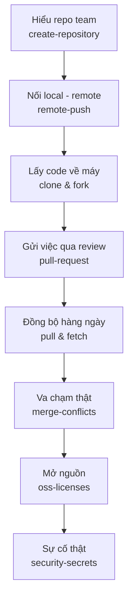

# Module 03: Collaboration với GitHub

**Bối cảnh:** Sandbox đã luyện xong. Hôm nay An mời bạn vào **`an-dev/task-board`** — repo thật có code của cả team. Từ đây mọi sai sót đều nhìn thấy được, nên module này dạy đúng *trình tự* cộng tác chứ không chỉ lệnh.

## Bản đồ vòng đời đóng góp

## Nội dung module

1. [Tạo Repository trên GitHub](create-repository.md) — những gì An đã chọn khi dựng repo.
2. [Remote & Push](remote-push.md) — cơ chế đồng bộ hai chiều, dùng sandbox học trước.
3. [Clone & Fork](fork-clone.md) — vào repo team bằng clone; fork dành cho OSS.
4. [Pull Request](pull-request.md) — PR drag-drop đầu tiên qua review của An.
5. [Pull & Fetch](pull-fetch.md) — nhịp sáng pull tối push.
6. [Merge Conflicts](merge-conflicts.md) — va chạm với Chi trên `board.js`.
7. [Giấy phép nguồn mở](oss-licenses.md) — task-board mở nguồn, chọn MIT.
8. [Lộ secret — Xử lý khẩn cấp](security-secrets.md) — .env của bạn bị push.

## Tiêu chí hoàn thành

- Một PR đi trọn vòng đời: mở → sửa theo review → merge → dọn nhánh.
- Giải quyết một conflict hai phía mà không abort chạy trốn.
- Thuộc lòng thứ tự vàng khi lộ secret: revoke TRƯỚC, dọn git SAU.

## Học tiếp

Vòng đời cộng tác đã trơn — giờ là hộp công cụ nâng cao: [Module 04: More Git](../04-more-git/index.md).
