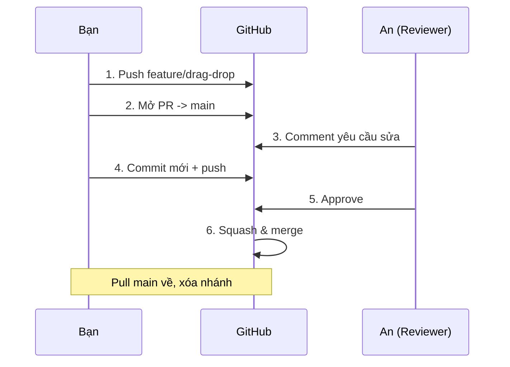

# Pull Request — Đề xuất hợp nhất code

> **Bối cảnh:** Tính năng drag-drop của bạn đã xong trên nhánh `feature/drag-drop`. An nói: *"Mở PR đi, tao review rồi mới merge vào main."* Đây là nghi thức quan trọng nhất của làm việc nhóm trên GitHub.

## PR giải quyết vấn đề gì?

Merge trực tiếp lên `main` = không ai đọc trước code, không ai chặn lỗi. Pull Request thêm lớp **kiểm soát hợp nhất**: thay đổi hiển thị công khai dưới dạng diff → được thảo luận theo từng dòng → được phê duyệt → rồi mới merge.

(GitLab gọi tương đương là Merge Request — bản chất một.)

## Bước 1: Push nhánh lên origin

```bash
git switch feature/drag-drop
git push -u origin feature/drag-drop
```

Output cuối:

```text
Create a pull request for 'feature/drag-drop' on GitHub by visiting:
    https://github.com/an-dev/task-board/pull/new/feature/drag-drop
```

GitHub thân thiện đưa sẵn link tạo PR ngay sau push.

## Bước 2: Mở PR

Bấm link trên (hoặc tab **Pull requests → New pull request**), chọn:

- **base**: `main` (nơi code sẽ đổ vào)
- **compare**: `feature/drag-drop` (code của bạn)

Viết mô tả theo khung ba phần:

```markdown
**Làm gì:** Thêm kéo thả sắp xếp thứ tự task trên board.

**Vì sao:** Issue #12 — user phải bấm nút lên/xuống rất bất tiện.

**Kiểm chứng:** Kéo card giữa các cột, reload trang, thứ tự được giữ.
Đã test Chrome + Firefox.
```

## Bước 3: Review — hai chiều

An đọc diff, comment ngay tại dòng có vấn đề:

> *Comment của An:* "Ở `drag-drop.js` dòng 42: dùng `event delegation` thay vì gắn listener từng card nhé — hiện tại card render động sẽ mất listener."

Bạn sửa code, rồi **đưa bản sửa lên bằng commit mới**:

```bash
git add drag-drop.js
git commit -m "Use event delegation for dynamically rendered cards"
git push
```

PR **tự cập nhật** với commit mới — không cần đóng mở lại. Đây là luồng chuẩn: review → commit mới → review tiếp → Approve.

> [!WARNING]
> Tuyệt đối không `push --force` đè lên nhánh đang được review — toàn bộ comment cũ rơi vào trạng thái lỗi thời, reviewer phải đọc lại từ đầu.

## Bước 4: Merge & dọn dẹp

An approve → merge bằng nút **Squash and merge** (gộp các commit WIP thành một commit sạch trên main — kỹ thuật chi tiết ở bài Rebase vs Merge vs Squash). Sau merge:

```bash
git switch main
git pull                      # lấy kết quả merge về máy
git branch -d feature/drag-drop   # dọn nhánh cục bộ
```

Nhánh trên remote cũng nên xóa (nút Delete branch trên GitHub) để danh sách branch không thành bãi rác.

## Vòng đời đầy đủ



## Chuẩn mực cho PR dễ sống còn

- **Một PR một chủ đề**, ≤ ~300 dòng diff thì reviewer thực sự đọc.
- Tiêu đề PR viết như commit message chuẩn.
- Không coi review là chỉ trích cá nhân — comment đánh giá code, không đánh giá người.

## References

- [GitHub Docs: About PRs](https://docs.github.com/en/pull-requests/collaborating-with-pull-requests/proposing-changes-to-your-work-with-pull-requests/about-pull-requests)
- [Pro Git 6.x: GitHub Flow](https://git-scm.com/book/en/v2/Distributed-Git-Distributed-Workflows)

## Học tiếp

[Pull & Fetch](pull-fetch.md) — trong lúc chờ review, Chi vừa đẩy code mới lên; cần đồng bộ an toàn.
