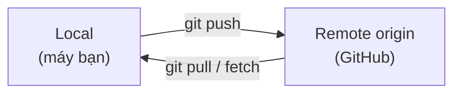

# Remote & Push — Kết nối local với GitHub

> **Bối cảnh:** Sandbox `task-board-sandbox` trên máy bạn đã có 5 commit. An bảo: *"Đẩy lên GitHub đi để mình review cách bạn commit."* Bạn tạo repo trống `you/task-board-sandbox` trên GitHub — giờ là lúc nối hai bên.

## Mô hình hai repository

Git là distributed: local và remote là **hai bản sao độc lập**, không tự đồng bộ:



Hệ quả phải khắc cốt ghi tâm: **commit chỉ nằm trên máy cho đến khi push**. Quên push cả ngày = đồng đội không thấy gì, và máy hỏng thì mất trắng.

## Bước 1: Thêm remote

```bash
git remote add origin git@github.com:you/task-board-sandbox.git
git remote -v
```

Output:

```text
origin  git@github.com:you/task-board-sandbox.git (fetch)
origin  git@github.com:you/task-board-sandbox.git (push)
```

Giải mã lệnh đầu: `remote add` = thêm kết nối; `origin` = **bí danh quy ước** cho remote chính; phần sau là URL SSH (đã setup key ở Module 01).

## Bước 2: Push lần đầu

```bash
git push -u origin main
```

Output:

```text
Enumerating objects: 12, done.
Writing objects: 100% (12/12), done.
Branch 'main' set up to track remote branch 'main' from 'origin'.
```

- `-u` (`--set-upstream`): ghi nhớ cặp `main` ↔ `origin/main`. Từ lần sau chỉ cần gõ `git push`.
- Refresh trang GitHub: lịch sử 5 commit hiện đầy đủ kèm code.

Vòng đời hàng ngày từ giờ chỉ còn:

```bash
git add . && git commit -m "..." && git push
```

## Khi push bị từ chối — tình huống thật đầu tiên

Một tuần sau, bạn push và gặp:

```text
 ! [rejected]        main -> main (fetch first)
error: failed to push some refs to 'github.com:you/task-board-sandbox.git'
hint: Updates were rejected because the remote contains work that you do not have
```

Nguyên nhân: có commit trên remote mà máy bạn chưa có. Git **từ chối ghi đè** để không âm thầm xóa công việc ai đó. Xử lý chuẩn:

```bash
git pull --rebase   # kéo commit mới về, đặt commit của bạn lên trên
git push            # giờ sẽ thành công
```

> [!WARNING]
> Đừng bao giờ "giải quyết" bằng `git push --force` ở giai đoạn này — nó xóa sạch commit của người khác trên remote. Vì sao rebase an toàn hơn được giải thích kỹ trong bài Rebase vs Merge vs Squash.

## Sai lầm thường gặp

- Gõ nhầm URL khi `remote add` → sửa bằng `git remote set-url origin <url>`, đừng remove rồi add lại mất cấu hình.
- Nghĩ commit xong là xong việc → quên push, cuối ngày An vẫn không thấy gì.
- Dùng HTTPS dù đã có SSH key → cứ hỏi token mỗi lần push.

## References

- [Pro Git 2.5: Working with Remotes](https://git-scm.com/book/en/v2/Git-Basics-Working-with-Remotes)
- [GitHub Docs: Pushing commits](https://docs.github.com/en/get-started/using-git/pushing-commits-to-a-remote-repository)

## Học tiếp

[Fork vs Clone](fork-clone.md) — hôm nay chính thức vào repo team `task-board`: lấy code về máy bằng clone.
