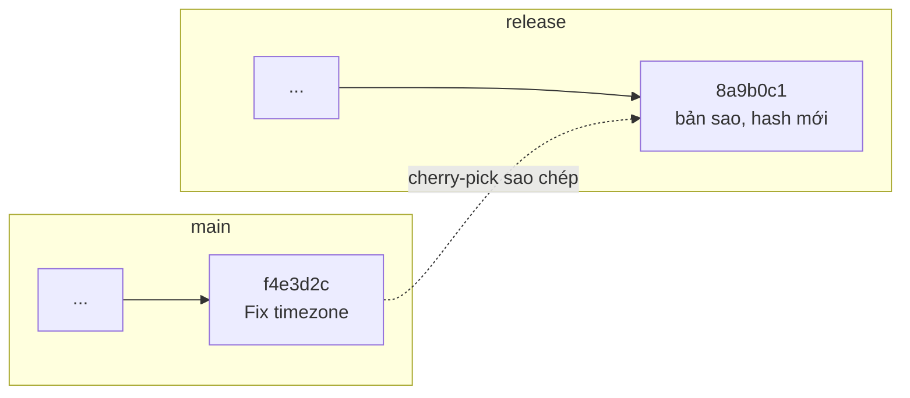

# git cherry-pick — Chọn một commit riêng

> **Bối cảnh:** Task-board có nhánh `release/1.0` chạy cho khách hàng pilot. Chi vừa fix bug timezone trên `main` (commit `f4e3d2c`), nhưng `release/1.0` không thể merge cả main — chỉ cần **đúng một commit đó**.

## Vấn đề mà cherry-pick giải quyết

Merge/rebase mang theo **toàn bộ** branch. Khi chỉ cần 1 commit trong khi cả branch chưa thể hợp nhất (chưa xong, đang thử nghiệm), cần công cụ chọn lọc điểm rơi.

## Bước 1: Xác định commit cần vá

```bash
git log --oneline main -5
```

```text
g7f6e5d Add CSV export (draft)
f4e3d2c Fix due date showing wrong day near midnight   <- cái cần
d3c2b1a Refactor task card component
```

## Bước 2: Cherry-pick sang release

```bash
git switch release/1.0
git cherry-pick f4e3d2c
```

Output:

```text
[release/1.0 8a9b0c1] Fix due date showing wrong day near midnight
 Author: Chi Tran <chi@congty.vn>
 Date: Tue Aug 25 16:40:02 2026 +0700
 1 file changed, 3 insertions(+), 1 deletion(-)
```

Cơ chế bên trong:



Hai điều quan trọng:

- Commit gốc trên `main` **giữ nguyên** — cherry-pick sao chép chứ không di chuyển.
- Bản mới có **hash khác** (`8a9b0c1` ≠ `f4e3d2c`) vì cha nó khác. Git không tự nhận hai bản là một khi sau này merge — có thể gặp conflict nhỏ hoặc commit trùng nội dung.

## Bước 3: Push và xác minh

```bash
git push origin release/1.0
```

Khách hàng pilot cập nhật, bug biến mất. An ghi chú trong issue: *"Fixed in release/1.0 via cherry-pick of f4e3d2c"* — truy vết rõ nguồn gốc.

## Khi gặp conflict

Nếu vùng code ở hai nhánh đã lệch nhau, cherry-pick dừng lại với conflict markers quen thuộc. Quy trình y hệt bài Merge Conflicts:

```bash
# sửa file, xóa marker...
git add <file>
git cherry-pick --continue    # hoặc --abort để hủy sạch sẽ
```

## Cherry-pick vs Merge vs Rebase

| Công cụ | Phạm vi | Kết quả |
|---|---|---|
| `merge` / `rebase` | Toàn bộ branch | Mang hết lịch sử |
| `cherry-pick` | **Từng commit chọn lọc** | Sao chép điểm rời rạc |

> [!TIP]
> Cần hơn 2–3 commit liên tiếp? Bạn thực ra cần rebase hoặc merge — cherry-pick hàng loạt làm lịch sử phân mảnh, không ai truy vết nổi nguồn gốc.

## Sai lầm thường gặp

- Cherry-pick rồi quên bản gốc → merge sau này gây commit trùng/conflict bất ngờ.
- Dùng cherry-pick thay merge để "đồng bộ" thường xuyên → lịch sử thành đám mây mảnh vụn.
- Lưu hash cũ rồi revert/cherry-pick lần nữa bằng hash sai — luôn lấy hash của **bản mới** trên nhánh đích.

## References

- [Pro Git 7.x: Cherry Picking](https://git-scm.com/book/en/v2/Git-Tools-Advanced-Merging)
- [git-cherry-pick docs](https://git-scm.com/docs/git-cherry-pick)

## Học tiếp

[Git Flow — Chiến lược phân nhánh cho team](git-flow.md) — release/1.0 bạn vừa thấy là một phần của mô hình lớn hơn.
