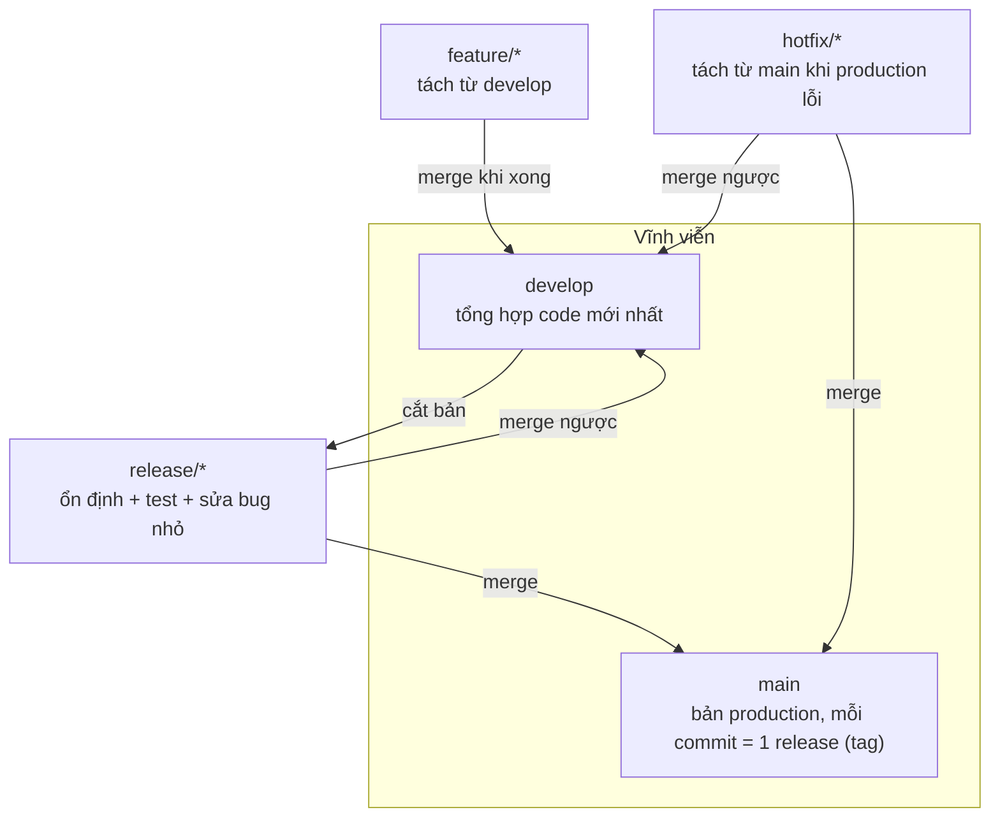

# Git Flow — Chiến lược phân nhánh cho team

> **Bối cảnh:** Task-board có khách hàng pilot chạy trên nhánh `release/1.0`, trong khi tính năng mới vẫn đổ vào `main`. An nhận ra: *"Chúng ta đang tự chế quy trình lộn xộn. Cần một mô hình chuẩn."* Sau bàn bạc, team chọn **Git Flow**.

## Vấn đề mà branching model giải quyết

Khi team chỉ có một `main`: code chưa ổn định và bản đang chạy trộn lẫn — không biết cắt bản phát hành từ đâu, hotfix dính cả nửa làm dở. Branching model trả lời ba câu hỏi bằng cấu trúc cố định:

1. Code nào là **bản đang chạy thật**?
2. Tính năng mới **tách từ đâu, về đâu**?
3. Bản phát hành và hotfix đi **lộ trình nào**?

## Mô hình Git Flow

Đề xuất bởi Vincent Driessen (2010), gồm hai branch vĩnh viễn và ba loại tạm thời:



| Branch | Sinh ra từ | Đổ về | Nhiệm vụ |
|---|---|---|---|
| `main` | — | — | Bản production; commit nào cũng được tag version (`v1.2.0`) |
| `develop` | main | — | Trạng thái tích hợp mới nhất của các tính năng |
| `feature/*` | develop | develop | Một tính năng riêng lẻ |
| `release/*` | develop | main + develop | Ổn định hóa: test, bump version, sửa bug nhỏ |
| `hotfix/*` | main | main + develop | Vá gấp production lỗi |

## Một tính năng đi qua Git Flow — từng bước

```bash
# 1. Tách feature từ develop
git switch develop && git pull
git switch -c feature/csv-export

# 2. Làm việc, commit bình thường... đến khi xong
git push -u origin feature/csv-export   # PR vào DEVELOP (không phải main)

# 3. Sau khi PR merge, cắt release khi đủ tính năng cho đợt phát hành
git switch develop && git pull
git switch -c release/1.1
echo "1.1.0" > VERSION                  # bump version, sửa bug nhỏ tại đây
git commit -am "Bump version to 1.1.0"

# 4. Phát hành: release đổ vào main + đánh tag
git switch main
git merge --no-ff release/1.1
git tag -a v1.1.0 -m "Release 1.1.0"
git push origin main --tags

# 5. Đồng bộ ngược develop để không mất các fix của release
git switch develop
git merge --no-ff release/1.1
git branch -d release/1.1
```

Hotfix production thì tách thẳng từ `main` (`git switch -c hotfix/fix-login main`), vá xong merge về **cả** main lẫn develop — đúng luồng bạn đã thấy bài cherry-pick dùng để đồng bộ fix sang `release/1.0`.

## Git Flow có phù hợp với mọi team? Không.

Ba mô hình phổ biến — chọn theo quy mô và nhịp phát hành:

| Tiêu chí | Git Flow | GitHub Flow | Trunk-Based |
|---|---|---|---|
| Số branch thường trực | 2 | 1 (`main`) | 1 (`main`) |
| Phù hợp | Có version release định kỳ, hỗ trợ nhiều bản cùng lúc | Web app deploy liên tục | Team mạnh kỷ luật CI/CD, deploy nhiều lần/ngày |
| Chi phí vận hành | Cao nhất | Thấp | Thấp nhất nhưng đòi automation |
| Ai đang dùng | Phần mềm cài đặt on-premise | Đa số web startup | Google, Facebook quy mô lớn |

> [!TIP]
> Với team nhỏ và sản phẩm web deploy liên tục, **GitHub Flow** (main + feature branch + PR) thường là lựa chọn đúng — chính là những gì bạn đã làm suốt Module 03. Git Flow đáng giá khi có nhu cầu **hỗ trợ nhiều phiên bản** song song như task-board pilot vừa rồi. Vincent Driessen himself đã ghi chú năm 2020: mô hình này dành cho "run-time software" chứ không phải web app luôn-deploy.

Quyết định của task-board: giữ Git Flow vì có khách pilot cần `release/*`; nếu sau này chuyển SaaS deploy liên tục → hạ cấp xuống GitHub Flow.

## Sai lầm thường gặp

- Áp dụng Git Flow máy móc cho team 2–3 người không có nhu cầu đa phiên bản — chi phí quản lý nhánh ăn mất lợi ích.
- Quên **merge ngược** release/hotfix về develop → các fix của production biến mất ở chu kỳ sau.
- Feature sống quá lâu (vài tháng) lệch khỏi develop → conflict chồng chất; tách tính năng nhỏ hơn.

## References

- [A successful Git branching model — Vincent Driessen](https://nvie.com/posts/a-successful-git-branching-model/)
- [GitHub Flow — GitHub Guides](https://docs.github.com/en/get-started/using-github/github-flow)
- [Trunk Based Development](https://trunkbaseddevelopment.com/)

## Học tiếp

[Cứu hộ — Tìm lại commit đã mất](rescue-reflog.md): hôm nay bạn sẽ lỡ tay reset --hard mất nửa ngày code.
