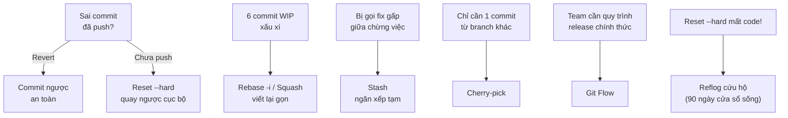

# Module 04: More Git

**Bối cảnh:** Tuần thứ hai tại task-board. Bạn đã quen nhịp PR; giờ là lúc đối mặt các tình huống thật: commit lỗi đã lên main, lịch sử WIP xấu xí, bị gọi fix gấp giữa chừng, và lần đầu lỡ tay mất code.

## Quy tắc xuyên suốt cả module

> **Lịch sử đã chia sẻ (push) thì chỉ được THÊM vào. Lịch sử riêng tư thì được VIẾT LẠI.**

Mọi công cụ dưới đây đều quy về quy tắc này:

## Nội dung module

1. [Revert & Hard Reset](revert-hard-reset.md) — commit của bạn làm vỡ trang board.
2. [Rebase vs Merge vs Squash](rebase-merge-squash.md) — 6 commit WIP phải dọn trước khi merge.
3. [git stash](stash.md) — bị gọi fix gấp Safari giữa chừng filter.
4. [git cherry-pick](cherry-pick.md) — vá nóng fix timezone lên release/1.0.
5. [Git Flow](git-flow.md) — team chọn mô hình phân nhánh chính thức.
6. [Cứu hộ — reflog](rescue-reflog.md) — bạn lỡ reset --hard mất nửa ngày code.
7. [Repository phình to](repo-performance.md) — 300MB PSD trong lịch sử.

## Tiêu chí hoàn thành

- Revert một commit trên main kèm tham chiếu issue, không force push.
- Squash một chuỗi commit WIP thành message sạch bằng `rebase -i`.
- Khôi phục thành công một "commit đã mất" từ reflog trong môi trường luyện tập.

## Học tiếp

Kỹ năng Git đã đủ dùng — giờ nâng cấp nền tảng cộng tác: [Module 05: More GitHub](../05-more-github/index.md).
