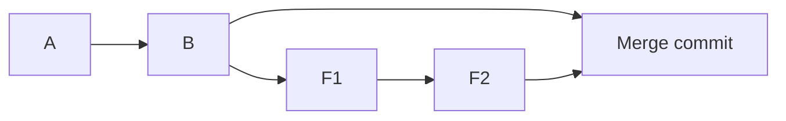
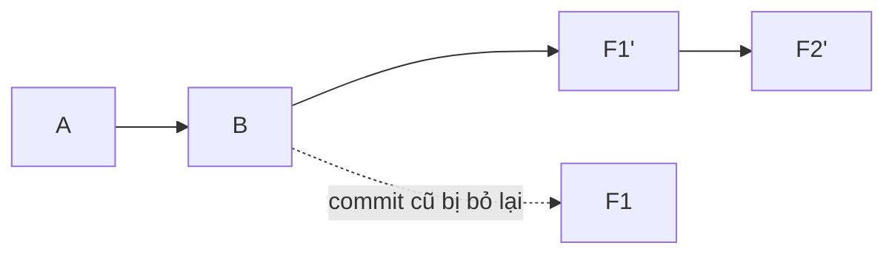

# Rebase vs Merge vs Squash

> **Bối cảnh:** PR tính năng filter của bạn có lịch sử như sau — An nhìn vào và nhăn mặt:

```text
* c9d0e1f (HEAD -> feature/filter) done???
* b8a7c6d fix typo again
* a7b6c5d wip
* f6e5d4c wip2 works maybe
* e5d4c3b refactor filter logic
* d4c3b2a start filter
```

*"Sáu commit này merge vào main thì ai đọc nổi gì? Dọn lại đi."* Bài này trả lời câu hỏi: **lịch sử nên kể câu chuyện thế nào?**

## Merge — giữ nguyên sự thật

```bash
git switch main
git merge feature/filter
```

Tạo **merge commit hai cha**, nối đúng như thực tế đã xảy ra:



- **Ưu điểm:** trung thực, không sửa gì, an toàn tuyệt đối trên branch chung.
- **Nhược điểm:** lưới lịch sử rối khi nhiều branch song song; mỗi pull mặc định thêm một merge commit nhiễu.

## Rebase — viết lại thành tuyến tính

Đứng trên nhánh tính năng, "nhấc" các commit của mình đặt lên đỉnh mới nhất của main:

```bash
git switch feature/filter
git rebase main
```



Git chép lại từng commit với **hash mới**. Lịch sử thẳng hàng như một truyện tuần tự — nhưng đây chính là điểm nguy hiểm: hash đổi nghĩa là lịch sử bị viết lại.

> [!WARNING]
> Quy tắc vàng: **rebase chỉ dùng cho commit chưa chia sẻ** (chưa push, hoặc nhánh chỉ mình bạn). Rebase nhánh public rồi force push = mọi người khác có commit "ma" trùng nội dung nhưng khác hash.

Ứng dụng an toàn nhất cho người mới — pull với rebase thay vì merge:

```bash
git pull --rebase        # cập nhật feature/filter bằng code mới của main
```

Không sinh merge commit nhiễu, diff trong PR luôn sạch so với main hiện tại.

## Squash — gộp n commit thành 1

Squash gộp chuỗi commit thành một commit duy nhất. Cách tương tác:

```bash
git rebase -i HEAD~6
```

Trình soạn thảo mở ra danh sách 6 commit — đổi `pick` thành `squash` cho 5 dòng cuối:

```text
pick d4c3b2a start filter
squash e5d4c3b refactor filter logic
squash f6e5d4c wip2 works maybe
squash a7b6c5d wip
squash b8a7c6d fix typo again
squash c9d0e1f done???
```

Lưu file → Git mở editor cho bạn **viết message mới đại diện cả chuỗi**:

```text
Add task filtering by assignee and status

Filter dropdown on board header; state persisted in URL query.
```

Kết quả trên `feature/filter`: một commit duy nhất, sạch sẽ. Trên GitHub, nút **Squash and merge** làm y hệt tự động lúc merge PR — cách team task-board đang dùng.

## Chọn công cụ nào — bảng quyết định

| Tình huống | Chọn |
|---|---|
| Hợp nhất nhánh vào main qua PR | Merge hoặc **Squash and merge** |
| Nhánh cá nhân cần code mới của main | `git rebase main` / `pull --rebase` |
| Branch chung nhiều người dùng | Chỉ merge — không bao giờ rebase |
| PR đầy commit WIP | Squash trước khi nhờ review |

Chuẩn của nhiều team (kể cả task-board): **"rebase local, squash khi merge"** — bạn thoải mái chỉnh lịch sử riêng đến giây phút mở PR; từ đó lịch sử bất động.

## Sai lầm thường gặp

- Rebase nhánh đã được người khác dựa vào rồi force push → conflict ma, mất việc của đồng đội.
- Sợ rebase vì tưởng xóa commit — commit cũ còn nằm trong reflog (bài cứu hộ), hiểu cơ chế thì hết sợ.
- Squash xong giữ nguyên message `"wip"` — mất trắng giá trị tài liệu của cả chuỗi.

## References

- [Pro Git 3.6: Rebasing](https://git-scm.com/book/en/v2/Git-Branching-Rebasing)
- [GitHub Docs: About merge methods](https://docs.github.com/en/repositories/configuring-branches-and-merges-in-your-repository/configuring-pull-request-merges/about-merging-a-pull-request)

## Học tiếp

[git stash — Cất tạm thay đổi](stash.md) — giữa chừng dọn nhánh, Bình gọi bạn fix gấp bug hiển thị.
