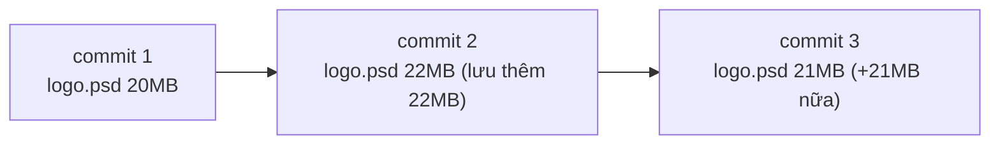

# Repository phình to — Nguyên nhân & cách xử lý

> **Bối cảnh:** An báo cáo trong họp: *"Repo task-board clone mất 4 phút — 300MB. Code chỉ có 5MB. Ai đã nhét gì vào?"* `git-sizer` chỉ tay vào folder `design/` chứa file PSD mockup bị commit và **sửa lại nhiều lần**.

## Vì sao Git phình to với binary?

Nhớ mô hình snapshot (Module 01): mỗi commit chụp toàn bộ cây thư mục; file text không đổi được tham chiếu lại, còn **file binary thay đổi thì lưu trùng nguyên vẹn từng phiên bản**:



Mười lần chỉnh logo = ~210MB lịch sử chết, dù thư mục hiện tại chỉ cần 1 file. Text source thì ngược lại — diff nhỏ, lưu rẻ. Đó là lý do Git sinh ra cho code.

## Bước 1: Chẩn đoán

```bash
git count-objects -vH
```

Output quan trọng nhất:

```text
size-pack: 298.44 MiB
```

Tìm thủ phạm cụ thể — top object to nhất:

```bash
git rev-list --objects --all |
  git cat-file --batch-check='%(objecttype) %(objectname) %(objectsize) %(rest)' |
  awk '/^blob/ {print $3, $4}' | sort -rn | head -10
```

```text
24576214 design/board-v3.psd
21345871 design/board-v2.psd
19876543 design/logo-dark.png
...
```

Thủ phạm hiện nguyên hình: các phiên bản PSD/PNG cũ vẫn nằm trong lịch sử.

## Bước 2: Chữa — viết lại lịch sử loại bỏ binary

Xóa file ở commit mới (như bài .gitignore dạy) **không giảm được dung lượng** — blob cũ vẫn nằm trong lịch sử. Phải viết lại lịch sử bằng công cụ chuẩn:

**BFG Repo-Cleaner** — một dòng lệnh thay hàng nghìn bước tay:

```bash
bfg --strip-blobs-bigger-than 5M
```

Sau đó team phải force-push đồng loạt + mọi người re-clone (giống quy trình dọn secret ở bài Security — cùng cơ chế viết lại lịch sử).

> [!WARNING]
> Viết lại lịch sử đổi mọi hash từ điểm can thiệp trở đi. Đây là việc của tech lead (An), thực hiện khi cả team biết rõ, KHÔNG phải thao tác cá nhân tự tiện.

## Bước 3: Phòng — quy tắc sống còn

**1. Binary build artifact không bao giờ commit:** `dist/`, `*.apk`, `node_modules/`, file compile — tất cả nằm trong `.gitignore` ngay ngày đầu.

**2. Asset thật sự cần version control → Git LFS** (Large File Storage): Git thay nội dung file bằng con trỏ, dữ liệu nặng nằm riêng:

```bash
git lfs install
git lfs track "*.psd" "*.mp4"     # ghi pattern vào .gitattributes
git add .gitattributes design/*.psd
```

LFS phù hợp với asset *thiết kế* cần lịch sử; nhưng cân nhắc: nhiều dịch vụ tính phí băng thông LFS. Mockup tham khảo có thể dùng Drive/Figma link trong README thay vì commit.

**3. Clone nhanh cho CI/máy yếu — shallow clone:**

```bash
git clone --depth 1 <url>     # chỉ lấy commit mới nhất, bỏ lịch sử
```

Hữu ích cho pipeline build; không dùng cho máy dev thường xuyên xem log.

## Sai lầm thường gặp

- Xóa file binary ở HEAD rồi tưởng repo gọn — dung lượng nằm ở lịch sử, không phải thư mục hiện tại.
- Commit video demo "đỡ phải gửi file" — 50MB × mỗi lần cắt lại = repo chết chậm.
- Dùng `--depth 1` rồi ngạc nhiên vì `git log` trống, pull bị lỗi lịch sử nông.

## References

- [Pro Git 10.x: Packfiles & maintenance](https://git-scm.com/book/en/v2/Git-Internals-Packfiles)
- [Git LFS docs](https://git-lfs.github.com/)
- [BFG Repo-Cleaner](https://rtyley.github.io/bfg-repo-cleaner/)

## Học tiếp

Sang [Module 05](../05-more-github/index.md): [GitHub Actions](../05-more-github/github-actions.md) — để máy tự kiểm tra thay vì loay hoay fix hậu quả.
