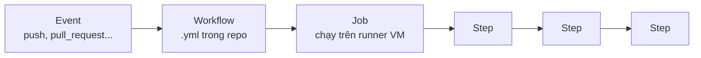

# GitHub Actions — Tự động hóa CI/CD

> **Bối cảnh:** Bạn mở PR tính năng export. Vài giây sau, dưới PR hiện dòng đỏ: **"All checks have failed — 1 failing check"**. An chưa đọc code mà đã biết nó vỡ test. Đó là sức mạnh của CI.

## Vấn đề mà CI giải quyết

Không có máy tự kiểm tra: ai cũng phải *tự giác* chạy test trước khi push — và sẽ có người quên. Bug vào main, cả team dừng việc. CI (Continuous Integration) đảo ngược bài toán: **mọi thay đổi đều bị máy kiểm tra bắt buộc** trước khi được merge; CD (Continuous Deployment) kéo dài thêm: test xong tự deploy.

## Mô hình bốn tầng



- **Event**: sự kiện khởi phát — push, mở/cập nhật PR, lịch cron...
- **Workflow**: file YAML tại `.github/workflows/` — đường dẫn này cứng, đặt sai là không bao giờ chạy.
- **Job**: nhóm bước trên một máy ảo runner (GitHub cấp miễn phí cho repo public).
- **Step**: một lệnh shell hoặc một action đóng gói sẵn từ marketplace.

## Bước từng bước: thêm CI cho task-board

An tạo file `.github/workflows/ci.yml`:

```yaml
name: CI

on:
  pull_request:
    branches: [main]
  push:
    branches: [main]

jobs:
  test:
    runs-on: ubuntu-latest
    steps:
      - uses: actions/checkout@v4        # tải code về runner
      - uses: actions/setup-node@v4      # cài Node 20
        with:
          node-version: 20
      - run: npm ci                      # cài dependency theo lockfile
      - run: npm test                    # chạy bộ test
```

Đọc hiểu từng khối:

- `on`: kích hoạt khi có PR vào `main` hoặc push thẳng lên `main`.
- `uses`: tái sử dụng action viết sẵn (checkout, setup môi trường) — đừng tự chế những gì cộng đồng đã chuẩn hóa.
- `run`: lệnh shell trực tiếp, chạy tuần tự từ trên xuống; step nào fail là job dừng ngay.

## Bước: trải nghiệm CI đỏ → xanh

Quay lại PR của bạn — bấm vào check failed:

```text
FAIL  tests/export.test.js
  ● exports tasks to CSV
    expect(received).toBe(expected)
    Expected: "title,assignee"
    Received: undefined
```

Log chỉ rõ file, tên test, expected vs received. Sửa code, `git push` — CI tự chạy lại, vòng tròn xanh:

```text
✓ test (12s) — All checks have passed
```

An approve, merge. Từ giờ **CI xanh là điều kiện merge** (branch protection) — chất lượng không phụ thuộc ý thức cá nhân ai nữa.

## Giá trị mở rộng khi quen dùng

- **Deploy tự động**: merge vào main → workflow build + publish lên hosting.
- **Cửa kiểm bổ sung**: lint, audit dependency, kiểm tra secret (gitleaks) — mỗi thứ một job.
- **Việc nhàm chán thành mã hóa**: gắn label, tạo release note, chào contributor mới.

> [!WARNING]
> Secret (API key, token deploy) KHÔNG BAO GIỜ viết trong file yml — repo public thì lộ ngay. Đặt ở Settings → Secrets and variables → Actions, tham chiếu qua `${{ secrets.TEN_BIEN }}`.

## Sai lầm thường gặp

- Đặt file ngoài `.github/workflows/` rồi thắc mắc workflow im lặng.
- Viết workflow 200 dòng trước khi bản 4 bước chạy xanh — luôn bắt đầu tối thiểu rồi mở rộng.
- Cache bỏ qua: mỗi lần chạy `npm ci` từ trắng tốn vài phút — học dùng `actions/cache` khi đã quen.

## References

- [GitHub Docs: Understanding GitHub Actions](https://docs.github.com/en/actions/understanding-github-actions)
- [Actions marketplace](https://github.com/marketplace?type=actions)

## Học tiếp

[GitHub CLI](github-cli.md) — thao tác với PR và checks mà không cần rời terminal.
