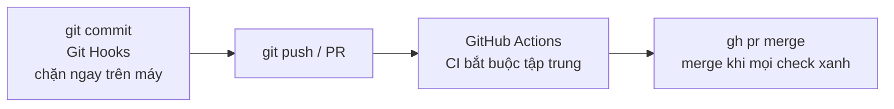

# Module 05: More GitHub

**Bối cảnh:** Tuần thứ ba. Kỹ năng Git của bạn đã vững; giờ là lúc biến GitHub từ "nơi chứa code" thành **hệ thống tự động bảo vệ chất lượng** — thứ phân biệt team chuyên nghiệp với nhóm làm việc thủ công.

## Bức tranh tự động hóa

Hai tầng phòng thủ bổ sung cho nhau: hooks nhanh nhưng có thể bỏ qua; CI chậm hơn một chút nhưng không ai né được.

## Nội dung module

1. [GitHub Actions](github-actions.md) — PR đầu tiên bị chặn vì CI đỏ.
2. [GitHub CLI](github-cli.md) — một ngày làm việc không rời terminal.
3. [Markdown](markdown.md) — viết lại README trước khi mở nguồn.
4. [Git Hooks](git-hooks.md) — chặn `.env` ngay tại `git commit`.

## Tiêu chí hoàn thành

- Workflow CI tối thiểu chạy xanh cho một PR thật.
- Vòng đời PR hoàn chỉnh bằng `gh`: create → checks → merge.
- Một pre-commit hook hoạt động (thử add .env là thấy bị chặn).

## Sau lộ trình này

Bạn đã đủ nền tảng tham gia bất kỳ team nào dùng Git. Lộ trình chi tiết tiếp theo: [roadmap.sh/git-github](https://roadmap.sh/git-github) — advanced interactive rebase, submodules, worktrees, monorepo tooling.
