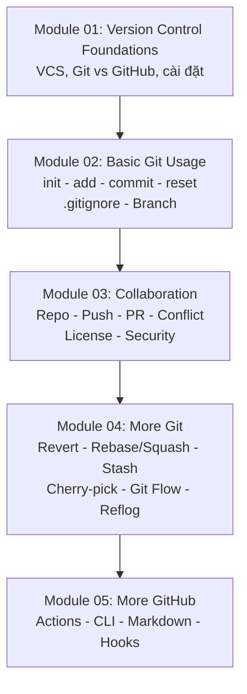

# Git & GitHub Beginner

Module dành cho người mới bắt đầu với hệ quản trị phiên bản. Lộ trình tham chiếu [roadmap.sh/git-github-beginner](https://roadmap.sh/git-github-beginner), tổ chức lại theo chuẩn Domain → Module → Topic của Knowledge OS và viết lại theo hướng **thực chiến từng bước**.

## Dự án mẫu xuyên suốt

Toàn bộ bài học quay quanh một kịch bản duy nhất để bạn làm theo từ đầu đến cuối:

- **Dự án:** `task-board` — ứng dụng web quản lý công việc nhóm (Kanban đơn giản: danh sách việc, kéo thả trạng thái, gán người thực hiện).
- **Team 4 người:**
  - **An** — tech lead, review Pull Request, quản lý nhánh `main`.
  - **Bình** — dev backend, phụ trách API.
  - **Chi** — dev frontend, đang song song tính năng với bạn.
  - **Bạn** — người mới vừa onboard, chưa từng dùng Git.

Mỗi bài mở đầu bằng dòng **Bối cảnh** cho biết bạn đang ở điểm nào của hành trình: ngày đầu cài đặt → tuần đầu commit → tham gia tính năng qua PR → xử lý sự cố thật (conflict, lộ secret, mất commit).

## Bản đồ lộ trình

## Thứ tự học tập

- **Module 01 — Version Control Foundations**: hiểu tối thiểu VCS giải quyết gì, cài đặt Git, kết nối GitHub bằng SSH.
- **Module 02 — Basic Git Usage**: vòng đời `init → add → commit`, unstage an toàn, `.gitignore`, branch đầu tiên.
- **Module 03 — Collaboration**: đẩy code lên GitHub, quy trình Pull Request, xử lý conflict, license, và xử lý khẩn cấp khi lộ secret.
- **Module 04 — More Git**: hoàn tác an toàn, rebase/squash, stash, cherry-pick, chiến lược phân nhánh Git Flow, cứu hộ bằng reflog và quản lý repository phình to.
- **Module 05 — More GitHub**: CI tự động bằng Actions, thao tác nhanh bằng CLI, viết README chuẩn Markdown, Git Hooks kiểm tra cục bộ.

## Học xong đạt được gì?

- Tham gia ngay một team thật: clone, branch, commit, push, PR mà không cần ai dắt tay.
- Xử lý được các tình huống sự cố phổ biến: conflict, lỡ reset, lộ API key.
- Hiểu quy ước team về phân nhánh và biết đặt câu hỏi đúng khi quy trình khác với những gì đã học.
